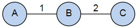
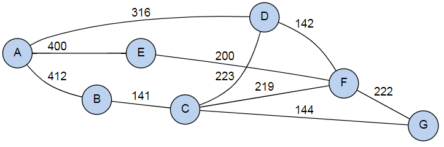
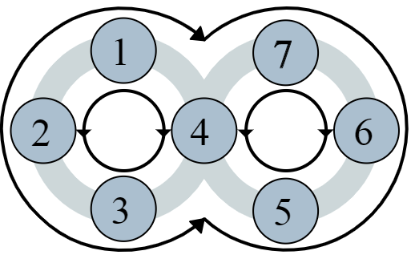
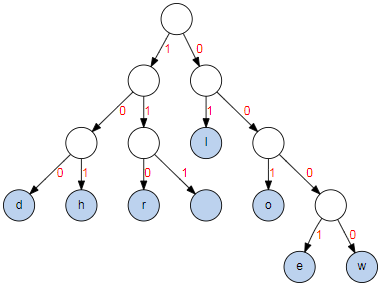

# Coding Challenge II: Polyglot

This is the successor of the coding challenge I created at the end of 2018 after my [first one](https://github.com/smurf667/cc1-java8) in 2015.

This coding challenge has parts in different languages:

- Java,
- JavaScript,
- Lisp and
- XSLT.

It is a good opportunity to hone your thinking, to refresh or get to know one of those programming languages.

## Execution constraints

Solution code will be run through a Java 8 executor.

- Java source code must compile for Java 8,
- JavaScript is run using the [Nashorn](https://www.oracle.com/technetwork/articles/java/jf14-nashorn-2126515.html) engine with ES6 compatibility as far as possible - see [limitations](http://openjdk.java.net/jeps/292),
- Lisp is executed using the [Armed Bear Common Lisp](https://abcl.org/) (ABCL) interpreter and
- Extensible stylesheet language transformations (XSLTs) are executed using the [Java API for XML Processing](https://docs.oracle.com/javase/8/docs/technotes/guides/xml/jaxp/index.html) (JAXP),
- no additional libraries are allowed for solutions.

## Hints

### Java

Your solution is expected in `de.engehausen.cc2.impl.<your-name>`.
In there, you **must** supply a `package-info.java` file which uses the `de.engehausen.cc2.api.Contribution` annotation. This annotation supplies information about where to find your code.

Here's an example for the contribution `deadbeef`:

```java
@Contribution(
  authors = { "Jane Doe, jane@doe.com", "John Doe, john@doe.com" },
  minimalEditDistance = DistanceImpl.class,
  pancakeFlipper = "/deadbeef/flipper.js"
)
package de.engehausen.cc2.impl.deadbeef;

import de.engehausen.cc2.api.Contribution;
```

This contribution only addresses two of the challenges: One in Java and one
in JavaScript. For JavaScript, the file must be located at `src/main/resources/deadbeef/flipper.js` if specified like above.

#### Testing

All challenges will be run using Maven and Java. You can run your implementations with the example inputs described below like this:

	mvn -Prun verify -Dscope=test [-Dresponselimit=<number-of-chars>] -DrunArgs="-filter=<your-name> -inputs=src/test/resources/testInputs.json"

This runs your implementations using inputs defined in `src/test/resources/testInputs.json`. The result is output to the console.
The `scope` argument is only required when using `testInputs.json`.
This is because the test inputs reference XML files that can only be found on the test classpath.

Feel free to define your own test input file to see how your solutions work for different inputs. More information about the test input format can be found [here](src/test/resources/testInputs.md). The package [`de.engehausen.cc2.verifiers`](src/main/java/de/engehausen/cc2/verifiers) contains the verifier implementations for each challenge.

All contributions will be tested against a currently undisclosed set of inputs and ranked according to the results.

### JavaScript

The browser itself is a good testbed. Modern browsers support more modern JavaScript than the limited Nashorn engine in Java 8 (see above), so make sure your code runs with Nashorn.

### Lisp

You can start the command line mode ([REPL](https://en.wikipedia.org/wiki/Read%E2%80%93eval%E2%80%93print_loop)) of ABCL using

	mvn initialize -Plisp

To exit the interpreter, type `(exit)`. Alternatively, you can play around [online](https://www.tutorialspoint.com/execute_lisp_online.php), but make sure the code runs with ABCL.

You can also pipe a script into the interpreter with the above command, e.g.

	mvn -Plisp initialize < myLisp.lisp

Remember some string/character comparisons are _case insensitive_ by default.
Note that the `sort` function in ABCL seems to behave a bit oddly compared to Common Lisp. It may be necessary to do `(setq mylist (sort mylist))` instead of the normally sufficient `(sort mylist)`.

### XSLT

You can start a stylesheet transformation on the command line using

	mvn compile -Pxslt -Din=in.xml -Dxslt=transform.xslt [-Dflags=...]

The result can be found in `target/out.xml`. A parameter `flags` is made available to the transformation, if specified.

Example invocation:

	mvn compile -Pxslt -Din=src/test/resources/xml/inHard.xml -Dxslt=src/test/resources/examples/xsltHardDemo.xslt -Dflags=x,y,z

Make sure the transformation runs with the Java executor. Namespace handling
is a bit finicky.

# Java

## Minimal Edit Distance

Given an input string and a desired result string, return a minimal number of single character operations which turn the input into the result string.

Example: To change the string `hello world!` into `hello, world`, the `,` character needs to be inserted, and the `!` character needs to be removed. Thus, the minimal edit distance is two, by inserting one character and removing another.

To solve this, implement `de.engehausen.cc2.api.EditDistanceFunction` and mark your implementation in your `package-info.java`.

Have a look at the [technical example](src/test/java/de/engehausen/cc2/impl/examples/MinimalEditDistanceDemo.java).

### Input constraints

The input will be valid strings between one and 50 characters.

## Busy Bee

A bee has to collect nectar from all flowers of a field. Not all routes are possible, some are geographically blocked. Information about travel time between the flowers is given. The bee must visit all flowers exactly once within a given time limit. The bee may decide to start at any flower.

Here is a simple example, with travel times marked on the edges:



Here, only `A` or `C` are reasonable "starting flowers". A time limit of less than three will make this impossible to solve, "starving the bee".

Just for illustration, here is a more complex field:



To solve this, implement `de.engehausen.cc2.api.BusyBeeFunction` and mark your implementation in your `package-info.java`.

Have a look at the [technical example](src/test/java/de/engehausen/cc2/impl/examples/BusyBeeDemo.java).

### Input constraints

The input will be valid graphs with at least one node, having up to 24 nodes.
It may be possible that no bee path will exist in the graph.

# JavaScript

## Pancake Flipper

Given an stack of differently sized pancakes and a pancake flipper which can turn all pancakes around at one position _up to the top_, return the flip operations required to put the stack into order, with the smallest on top and the largest on bottom. Pancakes can also be of the same size.

Here is an example:


In the input stack, the biggest pancake is on top, the smallest follows, and finally there is medium-sized one. First turning the whole stack around and then the top two ones only puts the stack into order. The flipping sequence thus is `2, 1`.

To solve this, provide a JavaScript file which has a function `process(stack)` and point to this in your `package-info.java`. The input is an array of the pancake sizes. The output is an array of positions in the array where a flip is required (index is zero-based).

Have a look at the [technical example](src/test/resources/examples/pancakeDemo.js).

### Input constraints

The input will be a valid stack having at least one pancake, and may have up to 50 pancakes.

## Happy Seven

The numbers one to seven are placed on two circular bands in some order. The bands are connected in the middle (i.e. they overlap). The left and right bands can be rotated clockwise and counter-clockwise, and all numbers can be rotated in both directions. Return the operations necessary to get the numbers into order (desired order is one to seven, placed counter-clockwise on the bands). The following diagram details the bands, placing and possible operations:



To further illustrate the six possible operations, study the following table:

| Operation |  |  |  |  |  |  |  |
|:---------:|---|---|---|---|---|---|---|
| `L-` | _2_ | _3_ | _4_ | _1_ | 5 | 6 | 7 |
| `L+` | _4_ | _1_ | _2_ | _3_ | 5 | 6 | 7 |
| `A+` | _7_ | _1_ | _2_ | _3_ | _4_ | _5_ | _6_ |
| ∅ | **1** | **2** | **3** | **4** | **5** | **6** | **7** |
| `A-` | _2_ | _3_ | _4_ | _5_ | _6_ | _7_ | _1_ |
| `R-` | 1 | 2 | 3 | _5_ | _6_ | _7_ | _4_ |
| `R+` | 1 | 2 | 3 | _7_ | _4_ | _5_ | _6_ |

Here is a simple example solving a possible input in just two steps:

| Operation |  |  |  |  |  |  |  |
|:---------:|---|---|---|---|---|---|---|
| ∅ | 1 | 2 | 3 | 5 | 6 | 7 | 4 |
| `A+` | _4_ | _1_ | _2_ | _3_ | _5_ | _6_ | _7_ |
| `L-` | **1** | **2** | **3** | **4** | **5** | **6** | **7** |

Rotating all input numbers counter-clockwise, and then the left band clockwise produces the happy sequence one to seven.

To solve this, provide a JavaScript file which has a function `process(config)` and point to this in your `package-info.java`. The input is an array of numbers that need to be transformed into happy order. The output is an array of operations required for this.

Have a look at the [technical example](src/test/resources/examples/happySevenDemo.js).

### Input constraints

The input will be valid, and a solution to the input will always be possible.

# Lisp

## Reverse Polish Notation

Given an expression in infix notation, turn it into Reverse Polish Notation.
The input can consist of the four operators `+`, `-`, `*` and `/`, and integer numbers greater than zero as well as parentheses for defining precedence. Addition and subtraction have the same precedence, but both multiplication and division have higher precedence, as per usual.

Simple example input:
```lisp
("100" "+" "1")
```

Expected output:
```lisp
("100" "1" "+")
```

The output must not contain parentheses characters. Here is a more complex example:
```lisp
("7" "*" "(" "6" "+" "4" "/" "2" ")")
```

Expected output:
```lisp
("7" "6" "4" "2" "/" "+" "*")
```

To solve this, provide a Lisp file which defines a function `process` and point to this in your `package-info.java`. The function must take one argument, a list with the elements of the expression in infix notation. The output is a list of elements of the expression in Reverse Polish Notation.

Have a look at the [technical example](src/test/resources/examples/rpnDemo.lisp).

### Input constraints

The input will be valid and will contain at least one operator. The input list will not exceed 100 elements.

## Huffman Coding

Given a string of characters, return a prefix-free binary code (a set of codewords) with minimum expected codeword length and the encoded string in binary notation.

Example input:
```lisp
"aaabc"
```

The output is a pair whose left side is a list of character to code word mappings, and the right side is the encoded string. The mappings are pairs of _character_ to code word mappings ("binary" _strings_ consisting of `0` and `1` characters). The encoded text is a "binary" _string_, consisting of the previously described code words.

Expected output (example):
```lisp
(((a . 0) (b . 11) (c . 10)) . 0001110)
```

Here is another, more complex example using `hello world` as the input string to encode. This could result in a code word tree such as:



The binary string `101 0001 01 01 001 111 0000 001 110 01 100` represents the input text, using just four bytes (not counting the code mapping, whitespaces introduced for readability, must not be part of the actual output).

To solve this, provide a Lisp file which defines a function `process` and point to this in your `package-info.java`. The function must take one argument, the input text as a string. The output is a list as described above.

Have a look at the [technical example](src/test/resources/examples/huffmanDemo.lisp).

### Input constraints

The input string will be valid and will contain at least one character, and may have a size of up to 1024 characters.

# Extensible Stylesheet Language Transformations (XSLT)

## Simple element transformation

Turn a XML document describing addresses from one format into another. The input document contains one root `data` element which nests three groups of elements:

- `item` (in `items`) - these are the addresses; they use `cityCode` and `countryCode` to reference elements in one of the other two groups
- `city` (in `cities`) - describes a city by its code
- `country` (in `countries`) - describes a country by its code

Here is an example (the namespace declaration is _required_):
```xml
<?xml version="1.0" encoding="UTF-8" ?>
<data xmlns="http://localhost/easy-in">
  <items>
    <item
      firstName="Jane"
      lastName="Doe"
      street="Sesame Street"
      cityCode="123"
      countryCode="CH" />
  </items>
  <cities>
    <city code="123">Lugano</city>
  </cities>
  <countries>
    <country code="CH" name="Switzerland" />
  </countries>
</data>
```

The goal is to output a transformed document which contains only a root `items` element. The root element lists all the `item` elements with sub-elements for the information, including resolved city and country information. Taking above example, this would be the expected output:

```xml
<?xml version="1.0" encoding="UTF-8"?>
<items xmlns:e="http://localhost/easy-in">
  <item>
    <name>Jane Doe</name>
    <address>Sesame Street</address>
    <city>Lugano</city>
    <country>Switzerland</country>
  </item>
</items>
```

Note the explicit namespace `e` on the root element is _required_. If needed, take a look at the schema definitions for the
[input](src/test/resources/xml/easy-in.xsd) and for the [output](src/test/resources/xml/easy-out.xsd).

To solve this, provide a XSLT file which performs the transformation and point to this in your `package-info.java`.

Have a look at the [technical example](src/test/resources/examples/xsltEasyDemo.xslt).

### Input constraints

The input will be valid, using the `http://localhost/easy-in` namespace. An `items` element will be present. City or country codes may reference entries not present in the respective `cities` or `countries` subtrees.

## Multi-rule based document transformation

Given an additional namespace which describes some rules for transformation and a transformation parameter, handle an input document according to these and output the expected result.

The `marker` namespace defines two attributes `anyOf` and `allOf`, which are mutually exclusive to each other and hold comma-separated lists of flags, without whitespaces. The parameter `flags` is passed in to the transformation and is also a list of flags (without whitespaces). The transformation must evaluate the attributes against the flags passed in and must retain or remove elements which match or don't match the conditions. Unused namespaces shall be dropped.

Here is an example:

```xml
<?xml version="1.0" encoding="UTF-8" ?>
<a xmlns:marker="http://localhost/marker">
  <b marker:anyOf="x,y,z">text1</b>
  <b marker:allOf="z,a">text2</b>
  <b xmlns:unused="http://localhost/unused">
    <c>text3</c>
  </b>
  <b xmlns:used="http://localhost/used">
    <!-- a comment -->
    <c>text4</c>
    <c used:used="true">text5</c>
  </b>
</a>
```

If the flag parameter passed in is `x,y,z` (or any combination, e.g. `z,x,y`), the `b` holding `text1` would stay in the output, while the `b` holding `text2` would be removed (`a` is not part of `flag`). As the declared namespace `unused` was not used in or under the `b` element declaring it, it must not occur in the output. However, the `used` namespace declared on the last `b` node must stay, as a child is using it. This is the expected output:

```xml
<?xml version="1.0" encoding="UTF-8" ?>
<a>
  <b>text1</b>
  <b>
    <c>text3</c>
  </b>
  <b xmlns:used="http://localhost/used">
    <!-- a comment -->
    <c>text4</c>
    <c used:used="true">text5</c>
  </b>
</a>
```

The two "conditional" `b` nodes would be dropped if `flags` was e.g. `a` or `hello,world` etc.

To solve this, provide a XSLT file which performs the transformation and can make use of the `flags` parameter and point to this in your `package-info.java`.

Have a look at the [technical example](src/test/resources/examples/xsltHardDemo.xslt).

### Input constraints

The input will be a valid XML document.

## Final words

I hope you enjoy the challenges! There is a seperate branch called [`solutions`](../../tree/solutions) which contains sample solutions (I'm not saying they are good, but they work). I suggest you don't spoil the fun by looking at them prematurely...
